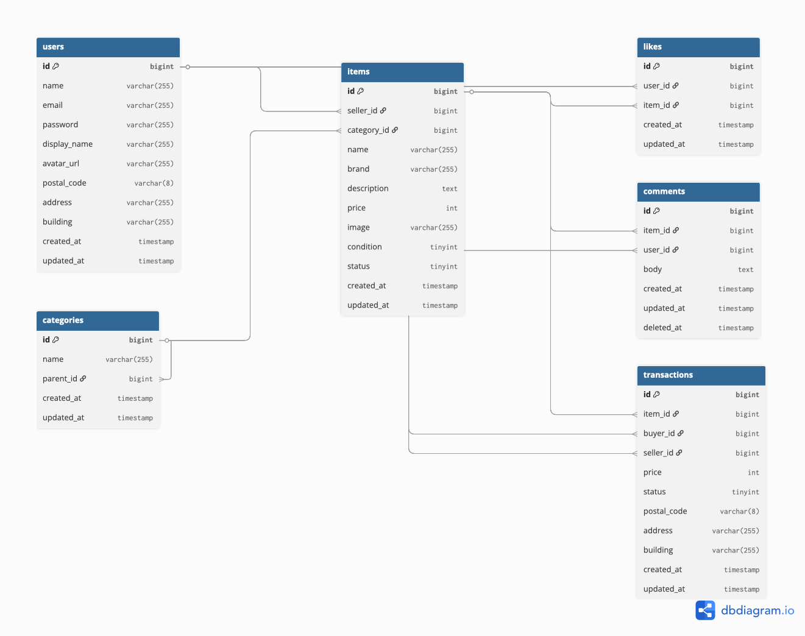

# COACHTECH フリマアプリ

## 環境構築
git clone git@github.com:ds1995-dev/mock-project.git
docker compose up -d --build
```

## Laravel環境構築
docker compose exec php bash
composer install
cp .env.example .env
php artisan key:generate
php artisan migrate
php artisan db:seed
```

## 使用技術（実行環境）
- PHP 8.2 (php:8.2-fpm)
- Laravel 12.0
- Laravel Fortify
- MySQL 8.4
- Nginx (nginx:latest)
- phpMyAdmin (phpmyadmin/phpmyadmin)
- MailHog (mailhog/mailhog)
- Stripe

## ER図


## URL
- 開発環境: http://localhost/
- phpMyAdmin: http://localhost:8080/
- MailHog: http://localhost:8025/

## 補足
- 会員登録後、mailHogにて認証でprofile設定に移行
- 海外在住のため、決済方法のkonbiniが実装できておらず、カード支払いで対応